## Excel Data Projects Portfolio

## Overview
This repository contains two data analysis projects completed using Microsoft Excel. The projects focus on data cleaning, preparation, transformation, and exploratory data analysis (EDA) to generate meaningful insights from raw datasets.

## Project 1: Data Cleaning and Preparation

Project Description
The purpose of this project was to clean and prepare raw business data for analysis using Microsoft Excel and Power Query. Several data quality issues such as duplicates, missing values, inconsistent formatting, and incorrect data types were identified and corrected.

Objectives
•	Improve overall data quality
•	Remove duplicate records
•	Handle missing values
•	Standardize data formats
•	Prepare the dataset for analysis and reporting

Tools Used
•	Microsoft Excel
•	Power Query

Dataset Information
The dataset contains business and operational records used for analytical reporting and data-driven decision-making.

Data Cleaning Process
The following cleaning operations were performed using Power Query:
1.	Removed duplicate rows
2.	Handled missing values
3.	Standardized text formatting
4.	Changed incorrect data types
5.	Renamed columns for consistency
6.	Structured the dataset for analysis

Power Query Techniques Used
•	Remove Duplicates
•	Replace Values
•	Change Data Types
•	Additional Columns
•	Filtering and Sorting
•	Data Transformation

Challenges Faced
•	Missing values
•	Duplicate records
•	Inconsistent formatting
•	Incorrect data types
Outcome
The raw dataset was successfully transformed into a clean, organized, and analysis-ready dataset suitable for reporting and further analysis.

## Project 2: Exploratory Data Analysis (EDA)

Project Description
This project focuses on exploring and analyzing data using Microsoft Excel to identify trends, patterns, relationships, and business insights.

Objectives
•	Analyze trends and patterns in the dataset
•	Summarize data using descriptive statistics
•	Identify key performance observations

Tools Used
•	Microsoft Excel
•	Pivot Tables
•	Descriptive Statistics
•	Quartile Calculations

Analysis Performed
The following analyses were conducted:
•	Descriptive statistical analysis
•	Pivot table analysis
•	Quartile calculations
•	Trend analysis
•	Category comparisons
•	Performance analysis

Analytical Techniques Used
•	Mean, Median, and Mode
•	Minimum and Maximum Values
•	Standard Deviation
•	Quartile Analysis
•	Frequency Distribution
•	Pivot Table Summarization
•	Data Filtering and Sorting

Key Insights
•	Certain categories consistently performed better than others
•	Some values showed high variability across records
•	Quartile analysis helped identify outliers and distribution patterns
•	Pivot tables simplified category analysis

Challenges Faced
•	Inconsistent formatting
•	Large data organization
•	Data preparation before analysis

Outcome
The exploratory data analysis provided meaningful insights and improved understanding of the dataset through statistical summaries and trend analysis.

## Project 3: SQL Retail Data Analysis

Project Overview

This project focused on analyzing the Online Retail Dataset using Microsoft SQL Server and SQL Server Management Studio (SSMS). The objective of the project was to apply SQL querying, data cleaning, filtering, aggregation, and reporting techniques to extract meaningful business insights from retail transaction data.

Tools Used
•	Microsoft SQL Server
•	SQL Server Management Studio
•	SQL

Database Setup and Data Cleaning

The dataset was successfully imported into SQL Server from a CSV file. Data cleaning and transformation processes were carried out to improve data quality and prepare the dataset for analysis.

The following cleaning tasks were performed:

Replaced blank values in the Coupon Code column with “No Coupon”
Created additional columns for:
•	Order_Year
•	Order_Month
Extracted date values using SQL date functions
 Verified and adjusted data types where necessary

SQL Skills and Techniques Applied

The project demonstrated practical use of SQL concepts and analytical functions, including:

SQL Clauses and Operations
•	SELECT
•	WHERE
•	ORDER BY
•	GROUP BY
•	HAVING
•	UPDATE

Aggregate Functions
•	SUM()
•	AVG()
•	COUNT()

Additional SQL Techniques
•	Date extraction functions
•	Conditional filtering
•	Data aggregation
•	Business reporting queries

Key Findings and Business Insights

Overall Metrics Performance

| Metric | Value |
|---|---|
| Total Orders | 1,200 |
| Total Revenue | 1,264,761.96 |
| Average Order Value | 1,053.97 |
| Average Quantity Ordered | 2 Items |
| Cancelled Orders | 251 |

Customer and Payment Insights

Most Used Payment Method
•	Online Payments (259 transactions)

Highest Revenue Payment Method
•	Credit Card — 263,847.63

Top Referral Source
•	Instagram (260 referrals)

Highest Revenue Referral Source
•	Instagram — 275,285.45

Product Performance

Top 3 Products by Revenue

| Product | Revenue |
|---|---|
| Chair | 195,620.11 |
| Printer | 195,612.61 |
| Laptop | 192,126.56 |

Products with sales greater than 2000 included:
•	Chair
•	Desk
•	Laptop
•	Monitor
•	Phone
•	Printer
•	Tablet

Highest Individual Total Price
•	Product: Tablet
•	Coupon Code: SAVE10
•	Total Price: 3,456.40

Lowest Recorded Price
•	Product: Phone
•	Referral Source: Email
•	Total Price: 11.39

Revenue Analysis

Revenue by Payment Method

| Payment Method | Total Revenue |
|---|---|
| Credit Card | 263,847.63 |
| Online | 262,442.94 |
| Cash | 259,786.29 |
| Gift Card | 246,323.92 |
| Debit Card | 232,361.18 |

Revenue by Referral Source

| Referral Source | Total Revenue |
|---|---|
| Instagram | 275,285.45 |
| Email | 261,808.55 |
| Google | 250,441.48 |
| Facebook | 250,410.90 |
| Referral | 226,815.58 |

Conclusion

This project demonstrated practical SQL and data analysis skills through the use of a real-world retail dataset. SQL queries were effectively used to clean, organize, analyze, and summarize transactional data into actionable business insights.

The analysis provided visibility into:
•	Customer behavior
•	Product performance
•	Payment trends
•	Revenue distribution

Overall, the project strengthened foundational SQL skills and showcased the ability to transform raw transactional data into meaningful business intelligence suitable for reporting and decision-making.

MARKDOWN
Repository Structure

Excel-Data-Projects/
│
├── Data-Cleaning-Project/
│ ├── raw_dataset.xlsx
│ ├── cleaned_dataset.xlsx
│ ├── power_query_steps.xlsx
│ └── README.md
│
├── EDA-Project/
│ ├── dataset.xlsx
│ ├── pivot_tables.xlsx
│ ├── descriptive_statistics.xlsx
│ ├── quartile_analysis.xlsx
│ └── README.md
│
├── SQL-Analysis-Project/
│   ├── online_retail_dataset.xlsx
│   ├── sql_queries.sql
│   ├── sql_analysis_report.docx
│   └── README.md

Excel-Data-Projects/
│
├── images/
│ ├── messy_data.png
│ ├── cleaned_data.png
│ ├── power_query_steps.png
│ ├── basic_descriptive_statistics.png
│ ├── advanced_descriptive_statistics.png
│ ├── pivot_tables.png
│ └── quartile_analysis.png
│
├── Data-Cleaning-Project/
├── EDA-Project/

SQL-Project/
│
├── images/
│ ├── creating_database.png
│ ├── table_created.png
│ ├── data_cleaning.png
│ ├── removing_blank_rows.png
│ ├── year_month_extraction.png
│ ├── filtering_records.png
│ └── sorting_records.png
│ ├── aggregate_function1.png
│ ├── aggregate_function2.png
│ ├── group_by.png
│ ├── having_clause.png
│ └── top_3_products.png
│
├──  SQL-Analysis-Project/

MARKDOWN
# Project Screenshots

## Messy Dataset

Initial raw dataset before cleaning and transformation.

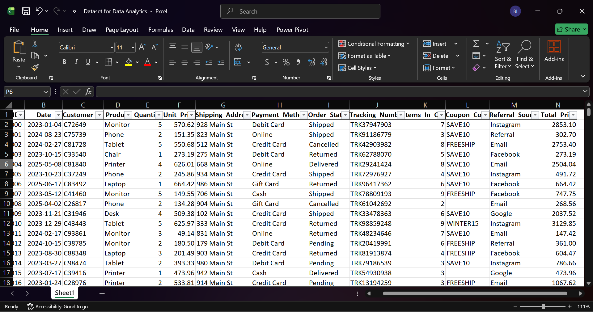

---

## Cleaned Dataset

Dataset after cleaning and preparation using Power Query.

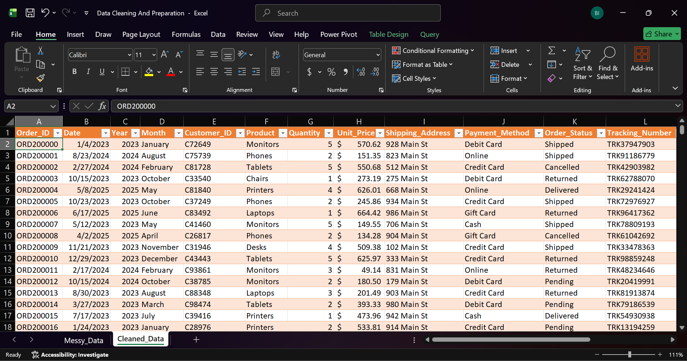

---

## Power Query Transformation Steps

Power Query was used to clean, transform, and standardize the dataset.

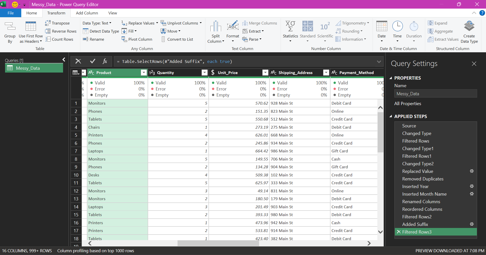

---

# Exploratory Data Analysis (EDA)

## Basic Descriptive Statistics

Summary statistics used to understand the dataset distribution.

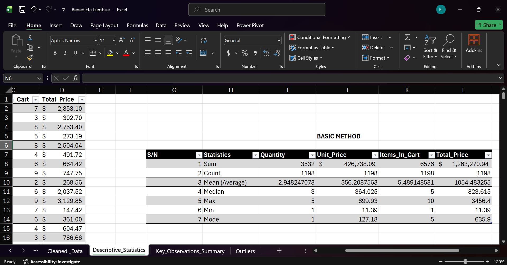

---

## Advanced Descriptive Statistics

Advanced statistical analysis for deeper data insights.

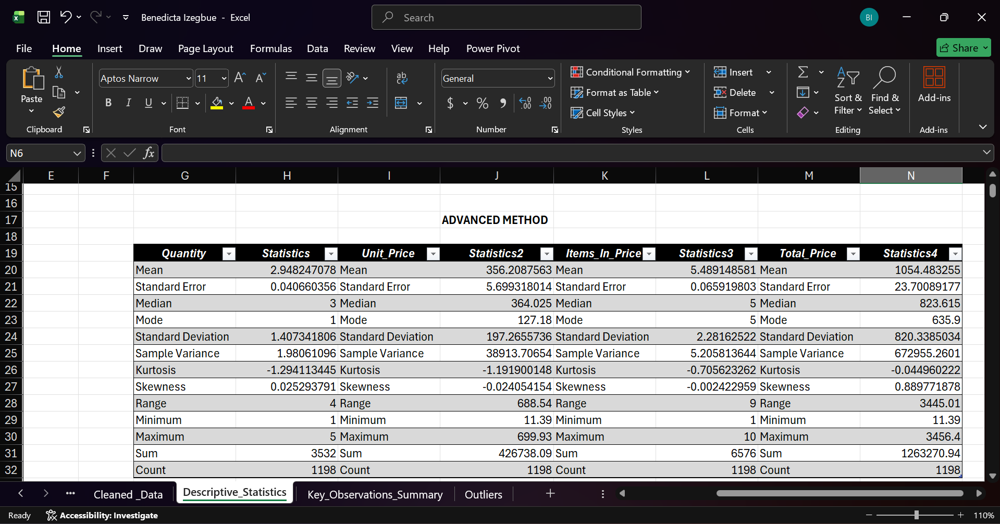

---

## Pivot Table Analysis

Pivot tables used to summarize and analyze trends.

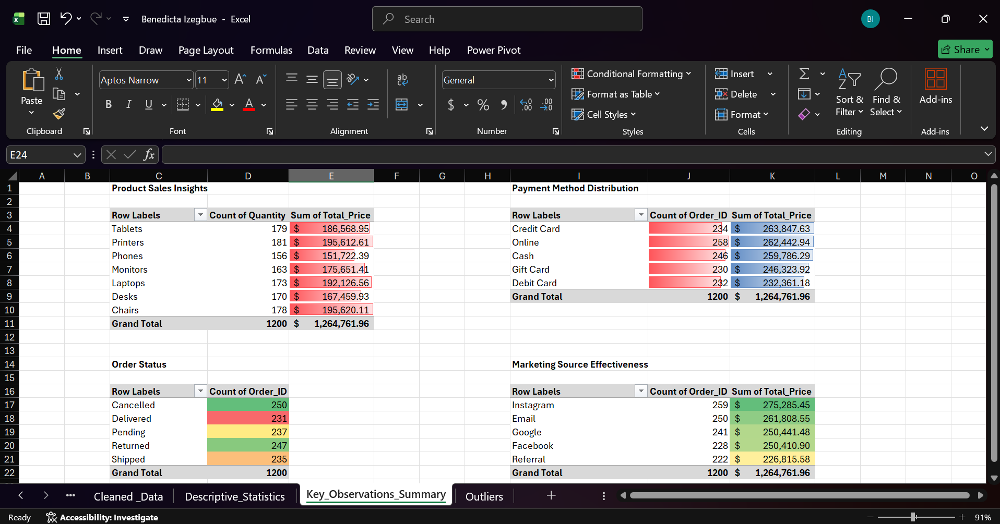

---

## Quartile Analysis

Quartile calculations used to identify data distribution and outliers.

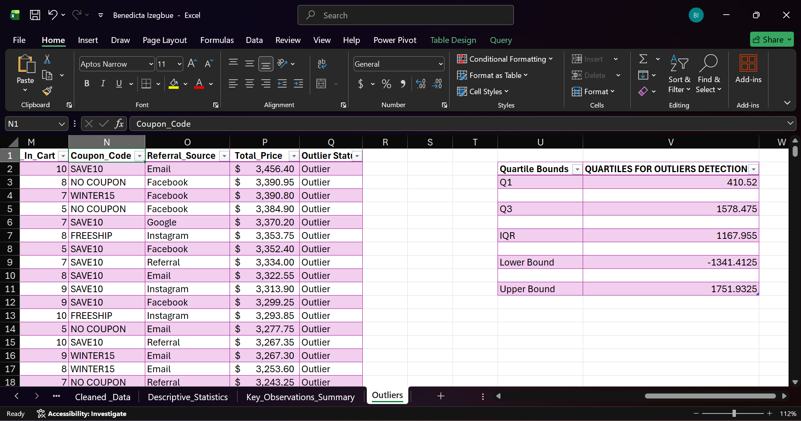

---

# SQL Project Screenshots

## Creating Database

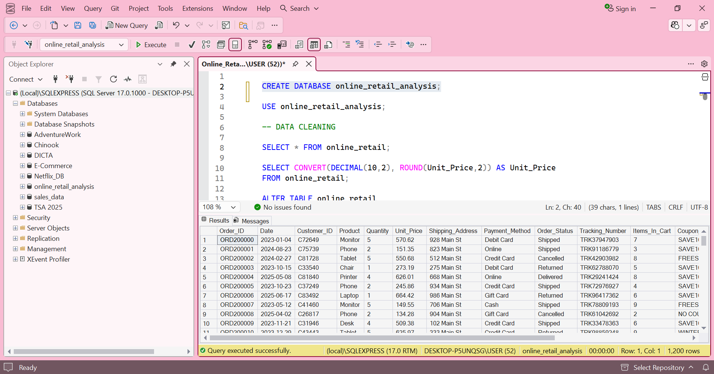

---

## Table Created

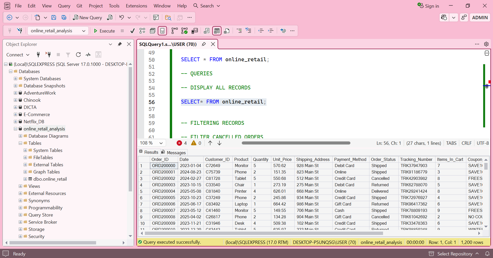

---

## Data Cleaning SQL

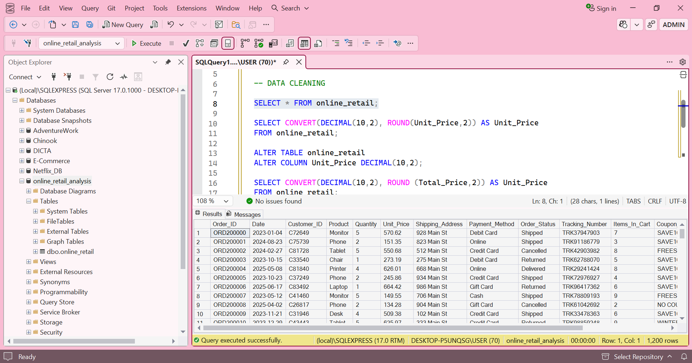

---

## Removing Blank Rows

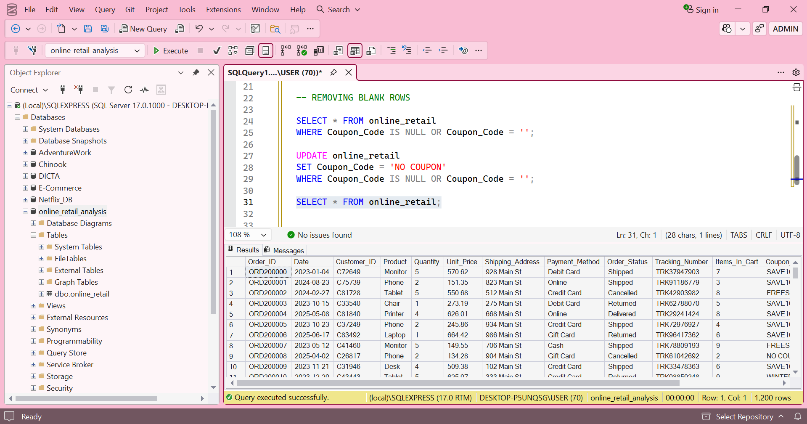

---

## Year and Month Extraction

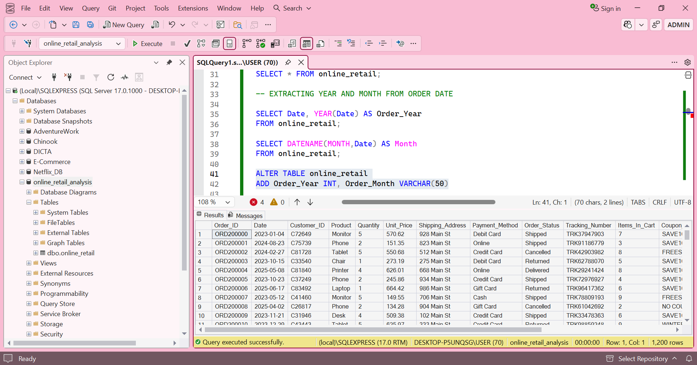

---

## Filtering Records

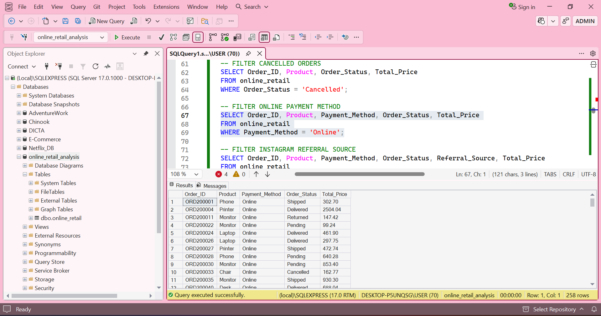

---

## Sorting Records

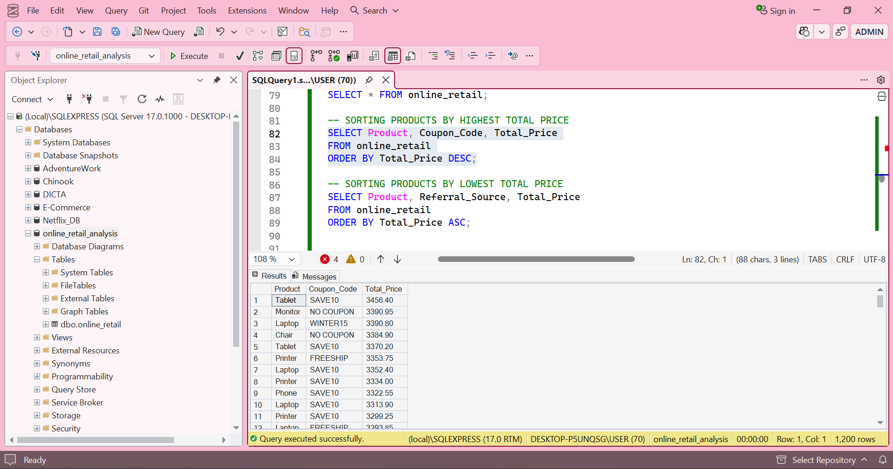

---

## Aggregate Functions

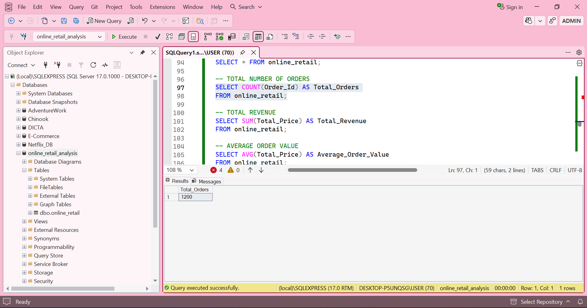

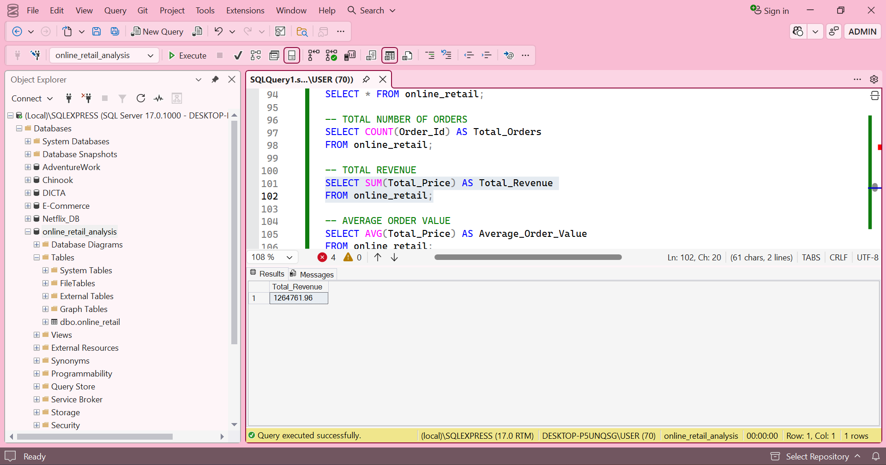

---

## GROUP BY Clause

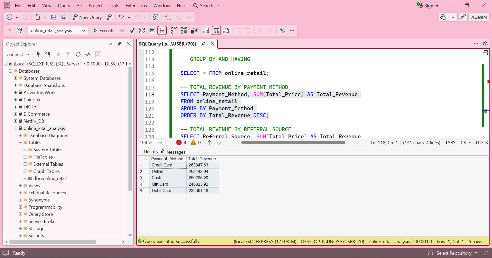

---

## HAVING Clause

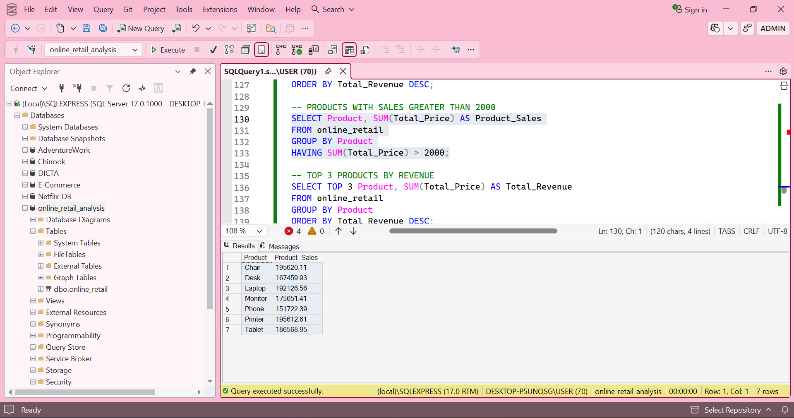

---

## Top 3 Products Query

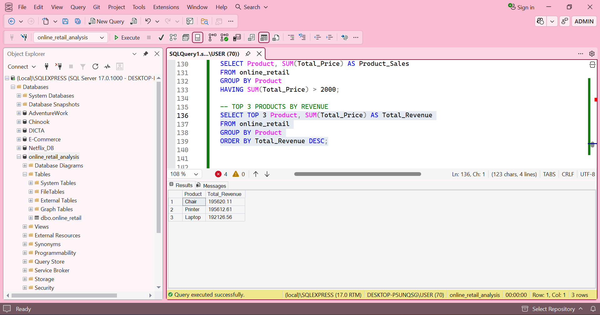

Skills Demonstrated
•	Data Cleaning
•	Data Preparation
•	Data Transformation
•	Exploratory Data Analysis
•	Descriptive Statistics
•	Pivot Table Analysis
•	Quartile Calculations
•	Data Visualization
•	Problem Solving
•	SQL Query Writing
•	Data Extraction
•	Data Filtering
•	Data Aggregation
•	Business Data Analysis
•	Database Management
•	Reporting and Insights Generation

## Author's Note

I am passionate about using data to solve problems, uncover trends, and support better decision-making. Through these projects, I developed practical experience in data cleaning, exploratory data analysis, and SQL-based business analysis using tools such as Microsoft Excel, Power Query, SQL Server, and SQL Server Management Studio (SSMS).

These projects strengthened my ability to transform raw and unstructured data into organized, meaningful, and actionable insights through data preparation, statistical analysis, visualization, and SQL querying techniques.

### Author

Benedicta Izegbue

Aspiring Data Analyst skilled in SQL, Excel, and Power BI with a strong interest in transforming raw data into meaningful business insights.

